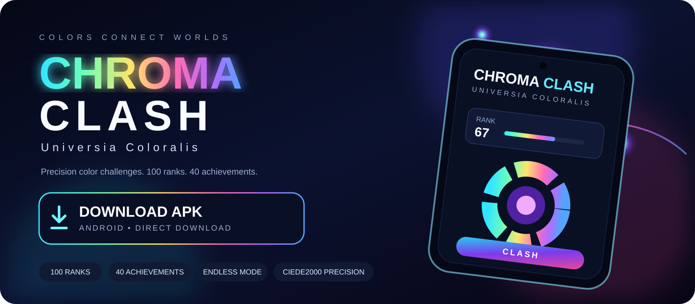
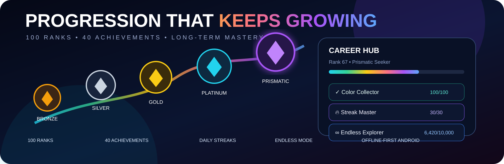
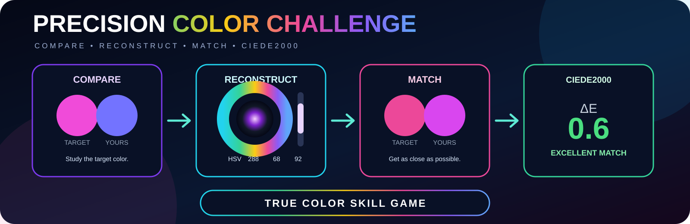

<div align="center">

# Chroma Clash — Universia Coloralis

**A neon sci-fi precision color game by KoSch**  
Offline-first Android build with **100 ranks**, **40 achievements**, **CIEDE2000 precision scoring** and long-term progression.

<a href="./downloads/chroma-clash.apk">
  
</a>

<br />

<a href="./downloads/chroma-clash.apk"></a>


### [⬇ Download the latest APK directly](./downloads/chroma-clash.apk)

</div>

---

## Precision color becomes progression

**Chroma Clash** turns color perception into a long-term Android skill game. Compare a target color, reconstruct it with the full HSV picker and get judged with real **CIE Lab / CIEDE2000 ΔE** color science instead of a forgiving RGB approximation.

- **100 ranks** across 10 leagues
- **40 achievements** with permanent XP rewards
- Standard, Marathon and Endless modes
- Flow, Clash, Precision and rank-aware Adaptive difficulty
- Full-gamut HSV color control
- Persistent local career stats, streaks and lifetime scoring
- Offline-first: no account, ad SDK, analytics SDK or mandatory network service

<p align="center">
  
</p>

<p align="center">
  
</p>

---

## APK download

**Direct file:** [`downloads/chroma-clash.apk`](./downloads/chroma-clash.apk)

The repository workflow rebuilds the Android APK from `main` and publishes the newest build to this path, so the large download artwork at the top remains a stable download target.

**Package:** `cloud.kosch.chromaclash`  
**Minimum Android:** API 26  
**Target SDK:** API 36

---

<details>
<summary><strong>Repository info / technical details — click to expand</strong></summary>

<br />

## Rank model

Each rank has a unique league/division title. The cumulative threshold is:

`XP(rank) = floor(140 × (rank-1)^1.75 + 300 × (rank-1))`

The curve starts quickly and becomes progressively harder. Rank 100 is designed as a genuine long-term mastery goal.

## Strict grading

| Grade | CIEDE2000 ΔE |
|---|---:|
| S+ | ≤ 0.60 |
| S | ≤ 1.50 |
| A | ≤ 3.00 |
| B | ≤ 6.00 |
| C | ≤ 10.00 |
| D | ≤ 16.00 |
| F | > 16.00 |

Gameplay accuracy is derived from ΔE (`100 − 4×ΔE`, clamped to 0–100). Difficulty, remaining time and streak quality influence score and XP.

## Modes

- **Standard Run** — 10 rounds
- **Marathon** — 25 rounds, unlocks at Rank 10
- **Endless** — unlocks at Rank 25
- Persistent career statistics and daily streak progression

## Build

### GitHub Actions

The workflow **Build Android APK** builds the debug APK on pushes to `main`, keeps the normal Actions artifact and also publishes the newest APK into `downloads/chroma-clash.apk` for the stable frontpage download link.

### Local build

Requirements: JDK 17+, Android SDK 36 and Gradle 9.5.

```bash
gradle :app:assembleDebug
```

Output:

```text
app/build/outputs/apk/debug/app-debug.apk
```

## Project layout

- `app/src/main/assets/www/` — bundled game UI and game engine
- `app/src/main/java/.../MainActivity.java` — Android WebView shell
- `docs/GAME_DESIGN.md` — progression and long-term design notes
- `.github/workflows/android-apk.yml` — repeatable APK build and frontpage APK publishing
- `assets/frontpage/` — repository showcase artwork
- `downloads/` — stable direct APK download target
- `play-store/` — Google Play submission notes and declarations

## Privacy

Progress is stored locally in Android WebView storage on the device. The current edition contains no analytics SDK, advertising SDK, tracking pixel, login requirement or mandatory remote model/API dependency.

See [`PRIVACY.md`](./PRIVACY.md).

</details>

---

<div align="center">

**Chroma Clash — More than a color game.**

Built by **KoSch**.

</div>
